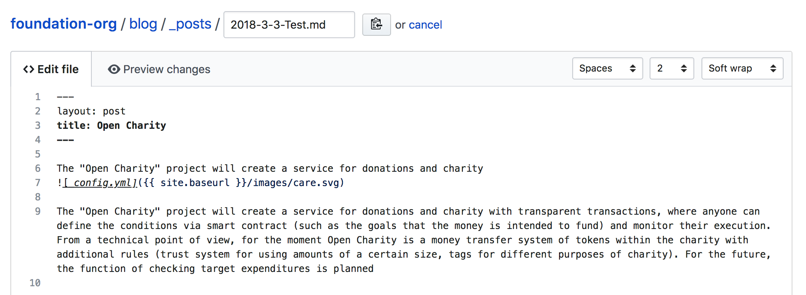

# Bankex Foundation

## Prerequisite
* node
* npm

## Installation
Make sure you have node.js and npm installed.

Clone the repository and install the dependencies

```bash
git clone https://github.com/BANKEX/foundation-org
cd foundation-org
npm install
npm install -g grunt-cli
```

## Build static resources

```bash
grunt
```

## Run

```bash
npm start
```

see the interface at http://localhost:3000

## Publishing blog post

### Editing
For edit post you need choose file in `blog/_posts/`. This [Markdown Cheatsheet](http://www.jekyllnow.com/Markdown-Style-Guide/) might come in handy.



### Adding

You can add additional posts in the browser on GitHub.com too! Just hit the + icon in `blog/_posts/` to create new content. Just make sure to include the [front-matter](http://jekyllrb.com/docs/frontmatter/) block at the top of each new blog post and make sure the post's filename is in this format: `year-month-day-title.md`

### Local Development

1. Install Jekyll and plug-ins in one fell swoop. `gem install github-pages` This mirrors the plug-ins used by GitHub Pages on your local machine including Jekyll, Sass, etc.
1. Serve the site `npm start`. For build `npm build`
1. View your website at http://localhost:3000/
1. Commit any changes and push everything to the master branch. Circleci will then rebuild to [new.bankexfoundation.org](https://new.bankexfoundation.org/).